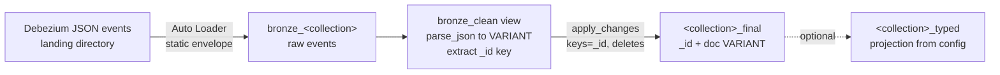

# dlt-debezium-mongodb — schemaless CDC ingestion with VARIANT

A single-file Delta Live Tables pipeline that ingests Debezium
(MongoDB) change-data-capture events for one collection into a Unity
Catalog bronze/silver pair — with **no schema inference, no schema
registry, and no reload on schema drift**.

Companion projects:
[debezium-cdc-pipeline](https://github.com/morillo/debezium-cdc-pipeline)
(metadata-driven multi-table framework, MySQL) and
[dlt-debezium-mysql](https://github.com/morillo/dlt-debezium-mysql)
(single-table MySQL pipeline).

## The problem

Debezium's MongoDB connector emits each document as a **single JSON
string** (MongoDB extended JSON) with no schema metadata whatsoever —
the connector cannot describe what it does not know, and MongoDB is
schemaless. Relational Debezium payloads carry typed structs and field
metadata; the MongoDB payload is just text:

```json
"after": "{\"_id\": {\"$oid\": \"65f1...\"}, \"name\": \"Alice\", ...}"
```

The historical solution was a custom schema-management layer:
`schema_of_json()` to infer a schema from sampled documents,
`from_json()` to apply it, a Delta table to persist inferred schemas,
and pipeline logic to reapply and evolve them. It works, but it is a
lot of machinery, the inferred schema is only as good as the sample,
and drift handling is an ongoing operational concern.

## The approach here: VARIANT

The `VARIANT` data type (Databricks Runtime 15.3+, GA; supported on
serverless) removes the need for any of that. The document is parsed
once — `parse_json(after)` — and stored as a typed, binary-encoded,
shredded column that preserves the full structure of every document
individually:

- **Schema drift is a non-event.** A document with new fields lands in
  the same column; nothing breaks, nothing reloads, no registry to
  update.
- **Consumers project types at read time**: `doc:address.city::string`,
  `doc:signup['$date']::long`. What used to be a stored schema is now
  a query expression.
- **The whole envelope schema becomes static.** Because the payload is
  a string, the Debezium MongoDB envelope is identical for every
  collection — this pipeline needs no per-collection schema derivation
  at all (its relational cousins do).

The medallion flow:



Details worth noting:

- **`_id` extraction** handles all extended-JSON key shapes with one
  coalesce chain: `{"$oid": ...}` documents, plain scalars (int/string
  ids), and composite keys (kept as canonical JSON text).
- **Ordering** is `struct(ts_ms, source.ord)` — the oplog ordinal
  breaks same-millisecond ties deterministically (the MongoDB
  equivalent of sequencing by binlog position).
- **Deletes** use the `before` pre-image; Kafka tombstones and events
  without a resolvable `_id` are dropped and counted by expectations.
- **Typed projection** (optional): set `pipeline.projection` to a
  semicolon-separated list of SQL expressions over `doc` and the
  pipeline materializes a `<collection>_typed` gold view. Changing the
  projection is a config edit + refresh — never a data reload. This is
  the declarative successor to a stored-schema approach.

When is the old `schema_of_json()`/`from_json()` approach still the
right tool? When a consumer contractually requires strictly typed
silver columns for every field. The modern form of that is
`schema_of_json_agg()` (infers one schema across all rows of a batch)
feeding `from_json()` — worth knowing, but for CDC current-state
serving, VARIANT plus projections is simpler, faster to operate, and
immune to drift.

## Configuration

Everything is parameterized; there is nothing to edit in the Python
file.

| Bundle variable | Pipeline setting | Default |
|---|---|---|
| `catalog` | (pipeline catalog) | `cdc_dev` |
| `target_schema` | (pipeline schema) | `cdc_mongo` |
| `landing_root` | `pipeline.landing_root` | `/Volumes/cdc_dev/landing/debezium` |
| `database` | `pipeline.database` | `shopdb` |
| `collection` | `pipeline.collection` | `customers` |
| `projection` | `pipeline.projection` | (unset — no typed view) |

Events are expected under
`<landing_root>/mongodb.<database>.<collection>/` (override the prefix
with `pipeline.topic_prefix` or the whole subdirectory with
`pipeline.topic`). One deployed pipeline ingests one collection.

Connector requirements: `capture.mode=change_streams_update_full` (full
documents on update) and pre-images enabled
(`change_streams_with_pre_images`) if deletes must be applied.

## Deploy and run

```bash
databricks bundle validate -t dev
databricks bundle deploy   -t dev --var="collection=customers"
databricks bundle run      -t dev dlt_debezium_mongodb \
  --var="collection=customers"
```

**Passing a projection**: the `--var` flag parses CSV-style and rejects
values containing quotes, so pass complex values through the CLI's
environment-variable form instead:

```bash
export BUNDLE_VAR_projection="doc:name::string AS name; \
doc:address.city::string AS city; \
cast(doc:signup['\$date']::long / 1000 as timestamp) AS signup_at"
databricks bundle deploy -t dev
databricks bundle run -t dev dlt_debezium_mongodb
```

### Databricks Free Edition

Verified end-to-end on Databricks Free Edition (serverless). Use the
built-in `workspace` catalog and a Unity Catalog volume for landing:

```bash
databricks schemas create cdc_mongo workspace
databricks fs cp -r ./events/ \
  dbfs:/Volumes/workspace/landing/debezium/

export BUNDLE_VAR_catalog=workspace
export BUNDLE_VAR_landing_root=/Volumes/workspace/landing/debezium
databricks bundle deploy -t dev
databricks bundle run -t dev dlt_debezium_mongodb
```

The verification run ingested snapshot reads, inserts, a full-document
update, a pre-image delete, a same-millisecond update+delete pair
(resolved correctly by oplog `ord`), a Kafka tombstone, and two
deliberately divergent documents — one with `{"$oid"}` and one with an
integer `_id`, one carrying fields no other document has. The final
table held exactly the expected current documents, drifted fields
intact, and the typed view projected them with proper types (including
`$date` → `timestamp`) — no schema was inferred or stored anywhere.

## Layout

```
dlt-debezium-mongodb/
├── databricks.yml                        # Asset Bundle: dev/test/prod
├── resources/dlt_pipeline.pipeline.yml   # Pipeline resource
└── src/dlt_pipeline_debezium_mongodb.py  # The entire pipeline
```
